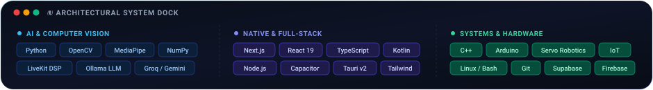

<!--
  Apple Minimalist Aesthetic Bento Profile Architecture (2026 Edition)
  Engineered for @maheshwarkibehan-hub
  Theme: Cupertino Dark Obsidian Glass | 100% Self-Hosted Vector Bento | Zero Table Tags
-->

<p align="center">
  
</p>

<p align="center">
  <a href="https://maheshwar.xyz"></a>
  &nbsp;
  <a href="https://github.com/maheshwarkibehan-hub"></a>
  &nbsp;
  <a href="https://komarev.com/ghpvc/?username=maheshwarkibehan-hub&color=0B111E&style=flat-square&label=VIEWS"></a>
</p>

<p align="center">
  <picture>
    <source media="(prefers-color-scheme: dark)" srcset="https://readme-typing-svg.demolab.com?font=SF+Pro+Display&weight=500&size=15&duration=3000&pause=1000&color=94A3B8&center=true&vCenter=true&width=620&lines=Building+voice-first+AI+assistants+%26+real-time+systems;Crafting+hardware+sensors%2C+robotics+%26+fluid+Android+apps;Class+10+student+architecting+software+from+Kaushambi%2C+India;Conceived%2C+designed%2C+and+coded+with+deep+craft.">
    <source media="(prefers-color-scheme: light)" srcset="https://readme-typing-svg.demolab.com?font=SF+Pro+Display&weight=500&size=15&duration=3000&pause=1000&color=475569&center=true&vCenter=true&width=620&lines=Building+voice-first+AI+assistants+%26+real-time+systems;Crafting+hardware+sensors%2C+robotics+%26+fluid+Android+apps;Class+10+student+architecting+software+from+Kaushambi%2C+India;Conceived%2C+designed%2C+and+coded+with+deep+craft.">
    
  </picture>
</p>

<!-- =================  BENTO GRID: ROW 1 (ASYMMETRIC DUAL) ================= -->
<p align="center">
  <a href="https://github.com/maheshwarkibehan-hub/vyaas-ai"></a>
  <a href="https://github.com/maheshwarkibehan-hub/chaksu-eye-detection"></a>
</p>

<!-- =================  BENTO GRID: ROW 2 (SYMMETRIC DUAL) ================= -->
<p align="center">
  <a href="https://github.com/maheshwarkibehan-hub/MElo-music-player"></a>
  <a href="https://github.com/maheshwarkibehan-hub/liquid-glass-launcher"></a>
</p>

<!-- =================  BENTO GRID: ROW 3 (HARDWARE & SYSTEMS STRIP) ================= -->
<p align="center">
  
</p>

<!-- =================  BENTO GRID: ROW 4 (SYSTEM TECH DOCK) ================= -->
<p align="center">
  
</p>

<!-- ================= TELEMETRY & ACTIVITY ================= -->
<p align="center">
  <picture>
    <source media="(prefers-color-scheme: dark)" srcset="https://github-readme-stats.vercel.app/api?username=maheshwarkibehan-hub&show_icons=true&hide_border=true&bg_color=00000000&title_color=ffffff&text_color=94a3b8&icon_color=38bdf8&include_all_commits=true&count_private=true">
    <source media="(prefers-color-scheme: light)" srcset="https://github-readme-stats.vercel.app/api?username=maheshwarkibehan-hub&show_icons=true&hide_border=true&bg_color=00000000&title_color=1e293b&text_color=64748b&icon_color=0284c7&include_all_commits=true&count_private=true">
    
  </picture>
  <picture>
    <source media="(prefers-color-scheme: dark)" srcset="https://streak-stats.demolab.com/?user=maheshwarkibehan-hub&hide_border=true&background=00000000&stroke=00000000&ring=38bdf8&fire=38bdf8&currStreakNum=ffffff&sideNums=ffffff&currStreakLabel=94a3b8&sideLabels=94a3b8&dates=94a3b8">
    <source media="(prefers-color-scheme: light)" srcset="https://streak-stats.demolab.com/?user=maheshwarkibehan-hub&hide_border=true&background=00000000&stroke=00000000&ring=0284c7&fire=0284c7&currStreakNum=1e293b&sideNums=1e293b&currStreakLabel=64748b&sideLabels=64748b&dates=64748b">
    
  </picture>
</p>

<!-- ================= TERMINAL FOOTER NAVIGATION ================= -->
<div align="center">
  <br/>
  <sub><i>"Technology at its highest craft is invisible, private, and deeply empowering."</i></sub>
  <br/><br/>
</div>

```
🟢 [STATUS: CLASS 10 · KAUSHAMBI, UP, INDIA] · ARCHITECTING SOVEREIGN SYSTEMS
```

<div align="center">
  <sub>© 2026 Maheshwar Hari Tripathi · Conceived with Cupertino Minimalist Principles</sub>
</div>
